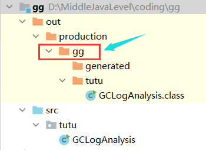
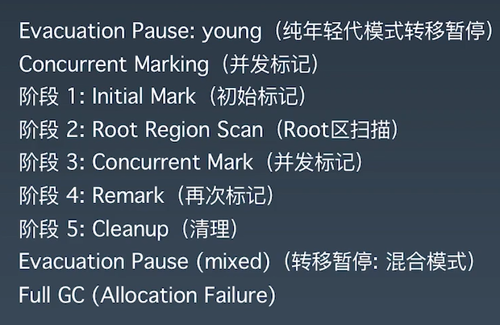

# 测试代码	

```java
/*
演示GC日志生成与解读
*/
public class GCLogAnalysis {
    // 随机数; 记得这里可以设置随机数种子;
    private static Random random = new Random();
    public static void main(String[] args) {
        // 当前毫秒时间戳
        long startMillis = System.currentTimeMillis();
        // 持续运行毫秒数; 可根据需要进行修改
        long timeoutMillis = TimeUnit.SECONDS.toMillis(1);
        // 结束时间戳
        long endMillis = startMillis + timeoutMillis;
        LongAdder counter = new LongAdder();
        System.out.println("正在执行...");
        // 缓存一部分对象; 进入老年代
        int cacheSize = 2000;
        Object[] cachedGarbage = new Object[cacheSize];
        // 在此时间范围内,持续循环
        while (System.currentTimeMillis() < endMillis) {
            // 生成垃圾对象
            Object garbage = generateGarbage(100*1024);
            counter.increment();
            int randomIndex = random.nextInt(2 * cacheSize);
            if (randomIndex < cacheSize) {
                cachedGarbage[randomIndex] = garbage;
            }
        }
        System.out.println("执行结束!共生成对象次数:" + counter.longValue());
    }

    // 生成对象
    private static Object generateGarbage(int max) {
        int randomSize = random.nextInt(max);
        int type = randomSize % 4;
        Object result = null;
        switch (type) {
            case 0:
                result = new int[randomSize];
                break;
            case 1:
                result = new byte[randomSize];
                break;
            case 2:
                result = new double[randomSize];
                break;
            default:
                StringBuilder builder = new StringBuilder();
                String randomString = "randomString-Anything";
                while (builder.length() < randomSize) {
                    builder.append(randomString);
                    builder.append(max);
                    builder.append(randomSize);
                }
                result = builder.toString();
                break;
        }
        return result;
    }
}
```

# 执行命令的bug

## ==错误: 找不到或无法加载主类==

```java
java -XX:+UseSerialGC -XX:+PrintGCDetails -Xms256m -Xmx256m  tutu.GCLogAnalysis
```

解决方案：



要在箭头所指的地方输入指令


# 串行gc

```java
java -XX:+UseSerialGC -XX:+PrintGCDetails -Xms256m -Xmx256m  GCLogAnalysis.java
```

## 256m:

```java
正在执行...
[GC (Allocation Failure) [DefNew: 69952K->8703K(78656K), 0.0140262 secs] 69952K->20808K(253440K), 0.0145968 secs] [Times: user=0.02 sys=0.00, real=0.02 secs]
[GC (Allocation Failure) [DefNew: 77926K->8702K(78656K), 0.0184485 secs] 90030K->43118K(253440K), 0.0188538 secs] [Times: user=0.00 sys=0.01, real=0.02 secs]
[GC (Allocation Failure) [DefNew: 78523K->8704K(78656K), 0.0155999 secs] 112939K->63183K(253440K), 0.0159594 secs] [Times: user=0.01 sys=0.00, real=0.02 secs]
[GC (Allocation Failure) [DefNew: 78598K->8702K(78656K), 0.0176807 secs] 133078K->88871K(253440K), 0.0180950 secs] [Times: user=0.02 sys=0.00, real=0.02 secs]
[GC (Allocation Failure) [DefNew: 78529K->8696K(78656K), 0.0157135 secs] 158697K->112596K(253440K), 0.0161658 secs] [Times: user=0.02 sys=0.00, real=0.02 secs]
[GC (Allocation Failure) [DefNew: 78648K->8703K(78656K), 0.0144000 secs] 182548K->133156K(253440K), 0.0147720 secs] [Times: user=0.00 sys=0.02, real=0.02 secs]
[GC (Allocation Failure) [DefNew: 78655K->8699K(78656K), 0.0156887 secs] 203108K->155235K(253440K), 0.0160573 secs] [Times: user=0.02 sys=0.00, real=0.02 secs]
[GC (Allocation Failure) [DefNew: 78651K->78651K(78656K), 0.0004685 secs][Tenured: 146535K->155015K(174784K), 0.0365305 secs] 225187K->155015K(253440K), [Metaspace: 2776K->2776K(105676
8K)], 0.0382081 secs] [Times: user=0.03 sys=0.00, real=0.04 secs]
[GC (Allocation Failure) [DefNew: 69952K->69952K(78656K), 0.0003086 secs][Tenured: 155015K->169048K(174784K), 0.0386919 secs] 224967K->169048K(253440K), [Metaspace: 2776K->2776K(105676
8K)], 0.0397975 secs] [Times: user=0.03 sys=0.01, real=0.04 secs]
[GC (Allocation Failure) [DefNew: 69952K->69952K(78656K), 0.0003131 secs][Tenured: 169048K->174502K(174784K), 0.0428772 secs] 239000K->175903K(253440K), [Metaspace: 2776K->2776K(105676
8K)], 0.0441866 secs] [Times: user=0.05 sys=0.00, real=0.05 secs]
[Full GC (Allocation Failure) [Tenured: 174502K->174437K(174784K), 0.0443531 secs] 252880K->179658K(253440K), [Metaspace: 2776K->2776K(1056768K)], 0.0447933 secs] [Times: user=0.03 sys
=0.00, real=0.04 secs]
[Full GC (Allocation Failure) [Tenured: 174638K->174733K(174784K), 0.0195335 secs] 253266K->195997K(253440K), [Metaspace: 2776K->2776K(1056768K)], 0.0199712 secs] [Times: user=0.03 sys
=0.00, real=0.02 secs]
[Full GC (Allocation Failure) [Tenured: 174733K->174744K(174784K), 0.0300547 secs] 253319K->203367K(253440K), [Metaspace: 2776K->2776K(1056768K)], 0.0304983 secs] [Times: user=0.01 sys
=0.00, real=0.03 secs]
[Full GC (Allocation Failure) [Tenured: 174744K->174764K(174784K), 0.0421793 secs] 253390K->217485K(253440K), [Metaspace: 2776K->2776K(1056768K)], 0.0428173 secs] [Times: user=0.05 sys
=0.00, real=0.04 secs]
[Full GC (Allocation Failure) [Tenured: 174764K->174736K(174784K), 0.0568452 secs] 253357K->215471K(253440K), [Metaspace: 2776K->2776K(1056768K)], 0.0574512 secs] [Times: user=0.06 sys
=0.00, real=0.06 secs]
[Full GC (Allocation Failure) [Tenured: 174736K->174736K(174784K), 0.0120637 secs] 253141K->225001K(253440K), [Metaspace: 2776K->2776K(1056768K)], 0.0127948 secs] [Times: user=0.02 sys
=0.00, real=0.01 secs]
[Full GC (Allocation Failure) [Tenured: 174736K->174681K(174784K), 0.0278385 secs] 253348K->231056K(253440K), [Metaspace: 2776K->2776K(1056768K)], 0.0282718 secs] [Times: user=0.02 sys
=0.00, real=0.03 secs]
[Full GC (Allocation Failure) [Tenured: 174681K->174729K(174784K), 0.0365185 secs] 252940K->232361K(253440K), [Metaspace: 2776K->2776K(1056768K)], 0.0371908 secs] [Times: user=0.03 sys
=0.00, real=0.04 secs]
[Full GC (Allocation Failure) [Tenured: 174729K->174208K(174784K), 0.0530122 secs] 253209K->228970K(253440K), [Metaspace: 2776K->2776K(1056768K)], 0.0534349 secs] [Times: user=0.05 sys
=0.00, real=0.05 secs]
[Full GC (Allocation Failure) [Tenured: 174208K->174208K(174784K), 0.0150337 secs] 252380K->237335K(253440K), [Metaspace: 2776K->2776K(1056768K)], 0.0153823 secs] [Times: user=0.02 sys
=0.00, real=0.02 secs]
[Full GC (Allocation Failure) [Tenured: 174208K->174208K(174784K), 0.0110934 secs] 252687K->240073K(253440K), [Metaspace: 2776K->2776K(1056768K)], 0.0117330 secs] [Times: user=0.02 sys
=0.00, real=0.01 secs]
[Full GC (Allocation Failure) [Tenured: 174746K->174746K(174784K), 0.0139123 secs] 253380K->242568K(253440K), [Metaspace: 2776K->2776K(1056768K)], 0.0148068 secs] [Times: user=0.00 sys
=0.00, real=0.02 secs]
[Full GC (Allocation Failure) [Tenured: 174746K->174374K(174784K), 0.0468796 secs] 253335K->236777K(253440K), [Metaspace: 2776K->2776K(1056768K)], 0.0473461 secs] [Times: user=0.05 sys
=0.00, real=0.05 secs]
[Full GC (Allocation Failure) [Tenured: 174590K->174590K(174784K), 0.0154384 secs] 253227K->242807K(253440K), [Metaspace: 2776K->2776K(1056768K)], 0.0158283 secs] [Times: user=0.01 sys
=0.00, real=0.02 secs]
[Full GC (Allocation Failure) [Tenured: 174768K->174768K(174784K), 0.0039737 secs] 253423K->245946K(253440K), [Metaspace: 2776K->2776K(1056768K)], 0.0043353 secs] [Times: user=0.00 sys
=0.00, real=0.00 secs]
[Full GC (Allocation Failure) [Tenured: 174768K->174768K(174784K), 0.0043537 secs] 253360K->247796K(253440K), [Metaspace: 2776K->2776K(1056768K)], 0.0047555 secs] [Times: user=0.00 sys
=0.00, real=0.00 secs]
[Full GC (Allocation Failure) [Tenured: 174768K->174773K(174784K), 0.0562776 secs] 253394K->242258K(253440K), [Metaspace: 2776K->2776K(1056768K)], 0.0567641 secs] [Times: user=0.06 sys
=0.00, real=0.06 secs]
执行结束!共生成对象次数:4567
Heap
 def new generation   total 78656K, used 69288K [0x00000000f0000000, 0x00000000f5550000, 0x00000000f5550000)
  eden space 69952K,  99% used [0x00000000f0000000, 0x00000000f43aa1f0, 0x00000000f4450000)
  from space 8704K,   0% used [0x00000000f4cd0000, 0x00000000f4cd0000, 0x00000000f5550000)
  to   space 8704K,   0% used [0x00000000f4450000, 0x00000000f4450000, 0x00000000f4cd0000)
 tenured generation   total 174784K, used 174773K [0x00000000f5550000, 0x0000000100000000, 0x0000000100000000)
   the space 174784K,  99% used [0x00000000f5550000, 0x00000000ffffd418, 0x00000000ffffd600, 0x0000000100000000)
 Metaspace       used 2782K, capacity 4486K, committed 4864K, reserved 1056768K
  class space    used 308K, capacity 386K, committed 512K, reserved 1048576K

```

分析：可以看到young gc最后几个（例如13）和full gc处理垃圾很少，说明这些对象当前都需要被引用，不能被当做垃圾处理掉，所以要扩大内存。最后程序运行完成后，结束之前，打印的可以看到，eden区和老年区使用99%也可印证。没有java.lang.OutOfMemoryError

，不过也快了。


## 2g:

 ```java
 D:\MiddleJavaLevel\coding\gg\out\production\gg>java -XX:+UseSerialGC -XX:+PrintGCDetails -Xms2g -Xmx2g  tutu.GCLogAnalysis
 正在执行...
 [GC (Allocation Failure) [DefNew: 559232K->69887K(629120K), 0.0927103 secs] 559232K->148504K(2027264K), 0.0930846 secs] [Times: user=0.05 sys=0.05, real=0.09 secs]
 [GC (Allocation Failure) [DefNew: 629119K->69887K(629120K), 0.120397	0 secs] 707736K->277842K(2027264K), 0.1207694 secs] [Times: user=0.02 sys=0.11, real=0.12 secs]
 [GC (Allocation Failure) [DefNew: 629119K->69887K(629120K), 0.1007482 secs] 837074K->401619K(2027264K), 0.1011846 secs] [Times: user=0.05 sys=0.05, real=0.10 secs]
 执行结束!共生成对象次数:7718
 Heap
  def new generation   total 629120K, used 491182K [0x0000000080000000, 0x00000000aaaa0000, 0x00000000aaaa0000)
   eden space 559232K,  75% used [0x0000000080000000, 0x0000000099b6b910, 0x00000000a2220000)
   from space 69888K,  99% used [0x00000000a6660000, 0x00000000aaa9fff0, 0x00000000aaaa0000)
   to   space 69888K,   0% used [0x00000000a2220000, 0x00000000a2220000, 0x00000000a6660000)
  tenured generation   total 1398144K, used 331731K [0x00000000aaaa0000, 0x0000000100000000, 0x0000000100000000)
    the space 1398144K,  23% used [0x00000000aaaa0000, 0x00000000bee94de8, 0x00000000bee94e00, 0x0000000100000000)
  Metaspace       used 2782K, capacity 4486K, committed 4864K, reserved 1056768K
   class space    used 308K, capacity 386K, committed 512K, reserved 1048576K
 
 ```

分析：这次gc次数很少，且都是young gc，垃圾从6位数变为5位数，效率非常高。young gc 时间最长的有100ms，有点长，这也说明处理掉垃圾越多，时间花费越长。

# 并行gc

## 512m:

```ja
D:\MiddleJavaLevel\coding\gg\out\production\gg>java -XX:+UseParallelGC -Xms512m -Xmx512m -XX:+PrintGCDetails tutu.GCLogAnalysis
正在执行...
[GC (Allocation Failure) [PSYoungGen: 131584K->21488K(153088K)] 131584K->47253K(502784K), 0.0121554 secs] [Times: user=0.00 sys=0.00, real=0.01 secs]
[GC (Allocation Failure) [PSYoungGen: 153072K->21498K(153088K)] 178837K->86814K(502784K), 0.0159559 secs] [Times: user=0.03 sys=0.09, real=0.02 secs]
[GC (Allocation Failure) [PSYoungGen: 153082K->21501K(153088K)] 218398K->128366K(502784K), 0.0183514 secs] [Times: user=0.03 sys=0.08, real=0.02 secs]
[GC (Allocation Failure) [PSYoungGen: 153085K->21494K(153088K)] 259950K->167033K(502784K), 0.0167026 secs] [Times: user=0.08 sys=0.05, real=0.02 secs]
[GC (Allocation Failure) [PSYoungGen: 153078K->21496K(153088K)] 298617K->210713K(502784K), 0.0194457 secs] [Times: user=0.05 sys=0.06, real=0.02 secs]
[GC (Allocation Failure) [PSYoungGen: 153080K->21492K(80384K)] 342297K->255313K(430080K), 0.0175647 secs] [Times: user=0.00 sys=0.13, real=0.02 secs]
[GC (Allocation Failure) [PSYoungGen: 80118K->34607K(116736K)] 313938K->274584K(466432K), 0.0112352 secs] [Times: user=0.00 sys=0.00, real=0.01 secs]
[GC (Allocation Failure) [PSYoungGen: 93336K->48236K(116736K)] 333313K->292821K(466432K), 0.0134625 secs] [Times: user=0.11 sys=0.00, real=0.01 secs]
[GC (Allocation Failure) [PSYoungGen: 107021K->57512K(116736K)] 351606K->309179K(466432K), 0.0170457 secs] [Times: user=0.11 sys=0.00, real=0.02 secs]
[GC (Allocation Failure) [PSYoungGen: 116158K->39135K(116736K)] 367825K->325709K(466432K), 0.0214401 secs] [Times: user=0.06 sys=0.02, real=0.02 secs]
[GC (Allocation Failure) [PSYoungGen: 98015K->21709K(116736K)] 384589K->343477K(466432K), 0.0174853 secs] [Times: user=0.08 sys=0.02, real=0.02 secs]
[Full GC (Ergonomics) [PSYoungGen: 21709K->0K(116736K)] [ParOldGen: 321768K->248964K(349696K)] 343477K->248964K(466432K), [Metaspace: 2776K->2776K(1056768K)], 0.0691341 secs] [Times: u
ser=0.44 sys=0.00, real=0.07 secs]
[GC (Allocation Failure) [PSYoungGen: 58763K->17057K(116736K)] 307727K->266021K(466432K), 0.0045853 secs] [Times: user=0.13 sys=0.00, real=0.00 secs]
[GC (Allocation Failure) [PSYoungGen: 75937K->19402K(116736K)] 324901K->284657K(466432K), 0.0098833 secs] [Times: user=0.11 sys=0.00, real=0.01 secs]
[GC (Allocation Failure) [PSYoungGen: 77790K->17795K(116736K)] 343044K->301816K(466432K), 0.0106880 secs] [Times: user=0.09 sys=0.00, real=0.01 secs]
[GC (Allocation Failure) [PSYoungGen: 76260K->20496K(116736K)] 360281K->321107K(466432K), 0.0103284 secs] [Times: user=0.00 sys=0.00, real=0.01 secs]
[Full GC (Ergonomics) [PSYoungGen: 20496K->0K(116736K)] [ParOldGen: 300610K->271328K(349696K)] 321107K->271328K(466432K), [Metaspace: 2776K->2776K(1056768K)], 0.0720651 secs] [Times: u
ser=0.38 sys=0.00, real=0.07 secs]
[GC (Allocation Failure) [PSYoungGen: 58871K->20362K(116736K)] 330200K->291691K(466432K), 0.0051881 secs] [Times: user=0.00 sys=0.00, real=0.01 secs]
[GC (Allocation Failure) [PSYoungGen: 79242K->19805K(116736K)] 350571K->310798K(466432K), 0.0117882 secs] [Times: user=0.11 sys=0.00, real=0.01 secs]
[GC (Allocation Failure) [PSYoungGen: 78685K->18952K(116736K)] 369678K->328633K(466432K), 0.0107914 secs] [Times: user=0.00 sys=0.00, real=0.01 secs]
[Full GC (Ergonomics) [PSYoungGen: 18952K->0K(116736K)] [ParOldGen: 309681K->285831K(349696K)] 328633K->285831K(466432K), [Metaspace: 2776K->2776K(1056768K)], 0.0729721 secs] [Times: u
ser=0.53 sys=0.00, real=0.07 secs]
[GC (Allocation Failure) [PSYoungGen: 58384K->21872K(116736K)] 344215K->307703K(466432K), 0.0067630 secs] [Times: user=0.00 sys=0.00, real=0.01 secs]
[GC (Allocation Failure) [PSYoungGen: 80263K->22238K(116736K)] 366094K->328950K(466432K), 0.0105120 secs] [Times: user=0.11 sys=0.00, real=0.01 secs]
[GC (Allocation Failure) [PSYoungGen: 81111K->18519K(116736K)] 387822K->347227K(466432K), 0.0128077 secs] [Times: user=0.06 sys=0.03, real=0.01 secs]
[Full GC (Ergonomics) [PSYoungGen: 18519K->0K(116736K)] [ParOldGen: 328707K->297255K(349696K)] 347227K->297255K(466432K), [Metaspace: 2776K->2776K(1056768K)], 0.0758107 secs] [Times: u
ser=0.36 sys=0.00, real=0.08 secs]
执行结束!共生成对象次数:6566
[GC (Allocation Failure) [PSYoungGen: 58880K->20161K(116736K)] 356135K->317416K(466432K), 0.0048098 secs] [Times: user=0.13 sys=0.00, real=0.00 secs]
Heap
 PSYoungGen      total 116736K, used 21339K [0x00000000f5580000, 0x0000000100000000, 0x0000000100000000)
  eden space 58880K, 2% used [0x00000000f5580000,0x00000000f56a67e8,0x00000000f8f00000)
  from space 57856K, 34% used [0x00000000fc780000,0x00000000fdb30558,0x0000000100000000)
  to   space 57856K, 0% used [0x00000000f8f00000,0x00000000f8f00000,0x00000000fc780000)
 ParOldGen       total 349696K, used 297255K [0x00000000e0000000, 0x00000000f5580000, 0x00000000f5580000)
  object space 349696K, 85% used [0x00000000e0000000,0x00000000f2249e50,0x00000000f5580000)
 Metaspace       used 2782K, capacity 4486K, committed 4864K, reserved 1056768K
  class space    used 308K, capacity 386K, committed 512K, reserved 1048576K

```

分析：

​	4次full gc， 20多次minor gc。

​	minor gc 每次10多ms；==每次full gc都会把young区清0==，而且80ms左右，非常快

## 2g:

```ja
D:\MiddleJavaLevel\coding\gg\out\production\gg>java -XX:+UseParallelGC -Xms2g -Xmx2g -XX:+PrintGCDetails -XX:-UseAdaptiveSizePolicy tutu.GCLogAnalysis
正在执行...
[GC (Allocation Failure) [PSYoungGen: 524800K->87031K(611840K)] 524800K->154284K(2010112K), 0.0494447 secs] [Times: user=0.16 sys=0.19, real=0.05 secs]
[GC (Allocation Failure) [PSYoungGen: 611831K->87035K(611840K)] 679084K->269363K(2010112K), 0.0663217 secs] [Times: user=0.20 sys=0.24, real=0.07 secs]
[GC (Allocation Failure) [PSYoungGen: 611835K->87038K(611840K)] 794163K->392351K(2010112K), 0.0597793 secs] [Times: user=0.20 sys=0.19, real=0.06 secs]
[GC (Allocation Failure) [PSYoungGen: 611838K->87039K(611840K)] 917151K->505646K(2010112K), 0.0575895 secs] [Times: user=0.22 sys=0.19, real=0.06 secs]
[GC (Allocation Failure) [PSYoungGen: 611839K->87032K(611840K)] 1030446K->613997K(2010112K), 0.0549458 secs] [Times: user=0.20 sys=0.13, real=0.05 secs]
执行结束!共生成对象次数:10221
Heap
 PSYoungGen      total 611840K, used 172311K [0x00000000d5580000, 0x0000000100000000, 0x0000000100000000)
  eden space 524800K, 16% used [0x00000000d5580000,0x00000000da8c7c38,0x00000000f5600000)
  from space 87040K, 99% used [0x00000000f5600000,0x00000000faafe368,0x00000000fab00000)
  to   space 87040K, 0% used [0x00000000fab00000,0x00000000fab00000,0x0000000100000000)
 ParOldGen       total 1398272K, used 526964K [0x0000000080000000, 0x00000000d5580000, 0x00000000d5580000)
  object space 1398272K, 37% used [0x0000000080000000,0x00000000a029d200,0x00000000d5580000)
 Metaspace       used 2782K, capacity 4486K, committed 4864K, reserved 1056768K
  class space    used 308K, capacity 386K, committed 512K, reserved 1048576K

```

分析：发生五次young gc ，时间都在60ms左右，gc处理的比较优秀

# CMS gc

## 512m:

```ja
D:\MiddleJavaLevel\coding\gg\out\production\gg>java -XX:+UseConcMarkSweepGC -Xms512m -Xmx512m -XX:+PrintGCDetails -XX:-UseAdaptiveSizePolicy tutu.GCLogAnalysis
正在执行...
[GC (Allocation Failure) [ParNew: 139776K->17471K(157248K), 0.0147138 secs] 139776K->41524K(506816K), 0.0151219 secs] [Times: user=0.05 sys=0.08, real=0.02 secs]
[GC (Allocation Failure) [ParNew: 156921K->17471K(157248K), 0.0179391 secs] 180973K->82157K(506816K), 0.0183796 secs] [Times: user=0.08 sys=0.03, real=0.02 secs]
[GC (Allocation Failure) [ParNew: 157247K->17472K(157248K), 0.0346291 secs] 221933K->128556K(506816K), 0.0350223 secs] [Times: user=0.20 sys=0.05, real=0.04 secs]
[GC (Allocation Failure) [ParNew: 157248K->17471K(157248K), 0.0293073 secs] 268332K->171512K(506816K), 0.0296803 secs] [Times: user=0.23 sys=0.01, real=0.03 secs]
[GC (Allocation Failure) [ParNew: 157247K->17472K(157248K), 0.0301296 secs] 311288K->214147K(506816K), 0.0304189 secs] [Times: user=0.24 sys=0.02, real=0.03 secs]
[GC (CMS Initial Mark) [1 CMS-initial-mark: 196675K(349568K)] 214389K(506816K), 0.0003456 secs] [Times: user=0.00 sys=0.00, real=0.00 secs]
[CMS-concurrent-mark-start]
[CMS-concurrent-mark: 0.003/0.003 secs] [Times: user=0.00 sys=0.00, real=0.00 secs]
[CMS-concurrent-preclean-start]
[CMS-concurrent-preclean: 0.001/0.001 secs] [Times: user=0.03 sys=0.00, real=0.00 secs]
[CMS-concurrent-abortable-preclean-start]
[GC (Allocation Failure) [ParNew: 157248K->17470K(157248K), 0.0300729 secs] 353923K->256328K(506816K), 0.0302660 secs] [Times: user=0.20 sys=0.03, real=0.03 secs]
[GC (Allocation Failure) [ParNew: 157246K->17469K(157248K), 0.0300702 secs] 396104K->299602K(506816K), 0.0302882 secs] [Times: user=0.22 sys=0.02, real=0.03 secs]
[GC (Allocation Failure) [ParNew: 157245K->17470K(157248K), 0.0322644 secs] 439378K->344921K(506816K), 0.0328218 secs] [Times: user=0.22 sys=0.02, real=0.03 secs]
[CMS-concurrent-abortable-preclean: 0.004/0.178 secs] [Times: user=0.72 sys=0.06, real=0.18 secs]
[GC (CMS Final Remark) [YG occupancy: 23661 K (157248 K)][Rescan (parallel) , 0.0003040 secs][weak refs processing, 0.0000380 secs][class unloading, 0.0003035 secs][scrub symbol table,
 0.0003371 secs][scrub string table, 0.0003254 secs][1 CMS-remark: 327450K(349568K)] 351112K(506816K), 0.0017462 secs] [Times: user=0.00 sys=0.00, real=0.00 secs]
[CMS-concurrent-sweep-start]
[CMS-concurrent-sweep: 0.001/0.001 secs] [Times: user=0.00 sys=0.00, real=0.00 secs]
[CMS-concurrent-reset-start]
[CMS-concurrent-reset: 0.001/0.001 secs] [Times: user=0.00 sys=0.00, real=0.00 secs]
[GC (Allocation Failure) [ParNew: 157246K->17471K(157248K), 0.0176378 secs] 443359K->349653K(506816K), 0.0183027 secs] [Times: user=0.13 sys=0.00, real=0.02 secs]
[GC (CMS Initial Mark) [1 CMS-initial-mark: 332181K(349568K)] 349775K(506816K), 0.0003104 secs] [Times: user=0.00 sys=0.00, real=0.00 secs]
[CMS-concurrent-mark-start]
[CMS-concurrent-mark: 0.002/0.002 secs] [Times: user=0.00 sys=0.00, real=0.00 secs]
[CMS-concurrent-preclean-start]
[CMS-concurrent-preclean: 0.001/0.001 secs] [Times: user=0.00 sys=0.00, real=0.00 secs]
[CMS-concurrent-abortable-preclean-start]
[CMS-concurrent-abortable-preclean: 0.000/0.000 secs] [Times: user=0.00 sys=0.00, real=0.00 secs]
[GC (CMS Final Remark) [YG occupancy: 35888 K (157248 K)][Rescan (parallel) , 0.0003956 secs][weak refs processing, 0.0000371 secs][class unloading, 0.0002861 secs][scrub symbol table,
 0.0003844 secs][scrub string table, 0.0002937 secs][1 CMS-remark: 332181K(349568K)] 368070K(506816K), 0.0017779 secs] [Times: user=0.00 sys=0.00, real=0.00 secs]
[CMS-concurrent-sweep-start]
[CMS-concurrent-sweep: 0.001/0.001 secs] [Times: user=0.03 sys=0.00, real=0.00 secs]
[CMS-concurrent-reset-start]
[CMS-concurrent-reset: 0.001/0.001 secs] [Times: user=0.00 sys=0.00, real=0.00 secs]
[GC (Allocation Failure) [ParNew: 156698K->17469K(157248K), 0.0174928 secs] 388236K->292637K(506816K), 0.0179629 secs] [Times: user=0.09 sys=0.01, real=0.02 secs]
[GC (CMS Initial Mark) [1 CMS-initial-mark: 275167K(349568K)] 293412K(506816K), 0.0002736 secs] [Times: user=0.00 sys=0.00, real=0.00 secs]
[CMS-concurrent-mark-start]
[CMS-concurrent-mark: 0.002/0.002 secs] [Times: user=0.00 sys=0.00, real=0.00 secs]
[CMS-concurrent-preclean-start]
[CMS-concurrent-preclean: 0.001/0.001 secs] [Times: user=0.00 sys=0.00, real=0.00 secs]
[CMS-concurrent-abortable-preclean-start]
[GC (Allocation Failure) [ParNew: 157245K->17469K(157248K), 0.0142573 secs] 432413K->334108K(506816K), 0.0144433 secs] [Times: user=0.13 sys=0.00, real=0.02 secs]
[GC (Allocation Failure) [ParNew: 157245K->157245K(157248K), 0.0004814 secs][CMS[CMS-concurrent-abortable-preclean: 0.002/0.071 secs] [Times: user=0.19 sys=0.00, real=0.07 secs]
 (concurrent mode failure): 316639K->282436K(349568K), 0.0736340 secs] 473884K->282436K(506816K), [Metaspace: 2776K->2776K(1056768K)], 0.0750945 secs] [Times: user=0.08 sys=0.00, real=
0.08 secs]
[GC (Allocation Failure) [ParNew: 139713K->17471K(157248K), 0.0128460 secs] 422149K->330835K(506816K), 0.0131812 secs] [Times: user=0.11 sys=0.00, real=0.01 secs]
[GC (CMS Initial Mark) [1 CMS-initial-mark: 313364K(349568K)] 333883K(506816K), 0.0007369 secs] [Times: user=0.00 sys=0.00, real=0.00 secs]
[CMS-concurrent-mark-start]
[CMS-concurrent-mark: 0.002/0.002 secs] [Times: user=0.00 sys=0.00, real=0.00 secs]
[CMS-concurrent-preclean-start]
[CMS-concurrent-preclean: 0.001/0.001 secs] [Times: user=0.02 sys=0.00, real=0.00 secs]
[CMS-concurrent-abortable-preclean-start]
[GC (Allocation Failure) [ParNew (promotion failed): 157247K->157247K(157248K), 0.0186923 secs][CMS[CMS-concurrent-abortable-preclean: 0.001/0.045 secs] [Times: user=0.14 sys=0.00, rea
l=0.04 secs]
 (concurrent mode failure): 349387K->306939K(349568K), 0.0834899 secs] 470611K->306939K(506816K), [Metaspace: 2776K->2776K(1056768K)], 0.1029010 secs] [Times: user=0.22 sys=0.00, real=
0.10 secs]
[GC (Allocation Failure) [ParNew: 139776K->139776K(157248K), 0.0003241 secs][CMS: 306939K->318204K(349568K), 0.0946712 secs] 446715K->318204K(506816K), [Metaspace: 2776K->2776K(1056768
K)], 0.0956949 secs] [Times: user=0.09 sys=0.00, real=0.10 secs]
[GC (CMS Initial Mark) [1 CMS-initial-mark: 318204K(349568K)] 318302K(506816K), 0.0003149 secs] [Times: user=0.00 sys=0.00, real=0.00 secs]
[CMS-concurrent-mark-start]
执行结束!共生成对象次数:7895
Heap
 par new generation   total 157248K, used 5656K [0x00000000e0000000, 0x00000000eaaa0000, 0x00000000eaaa0000)
  eden space 139776K,   4% used [0x00000000e0000000, 0x00000000e0586318, 0x00000000e8880000)
  from space 17472K,   0% used [0x00000000e9990000, 0x00000000e9990000, 0x00000000eaaa0000)
  to   space 17472K,   0% used [0x00000000e8880000, 0x00000000e8880000, 0x00000000e9990000)
 concurrent mark-sweep generation total 349568K, used 318204K [0x00000000eaaa0000, 0x0000000100000000, 0x0000000100000000)
 Metaspace       used 2782K, capacity 4486K, committed 4864K, reserved 1056768K
  class space    used 308K, capacity 386K, committed 512K, reserved 1048576K
[CMS-concurrent-mark: 0.001/0.001 secs] [Times: user=0.00 sys=0.00, real=0.00 secs]

```

分析：可以看到cms处理老年代跨度非常大，比如初始标记到标记重置，从9->23，期间有minor gc。每次minor gc也就20多ms，而cms并发处理的每次时间短到可以忽略不计，但是发生concurrent mode failure**也就是老年代正在清理，从年轻代晋升了新的对象，或者直接分配大对象年轻代放不下导致直接在老年代生成，这时候老年代也放不下**），时间就会停顿很长，100多毫秒，退化成serial gc，应用线程全部暂停。

处理方案：

```ba
可能原因及方案
原因1：CMS触发太晚
方案：将-XX:CMSInitiatingOccupancyFraction=N调小；

原因2：空间碎片太多
方案：开启空间碎片整理，并将空间碎片整理周期设置在合理范围；

-XX:+UseCMSCompactAtFullCollection （空间碎片整理）

-XX:CMSFullGCsBeforeCompaction=n

原因3：垃圾产生速度超过清理速度
晋升阈值过小；

Survivor空间过小；

Eden区过小，导致晋升速率提高；

存在大对象；
```

## 2g:

```java
D:\MiddleJavaLevel\coding\gg\out\production\gg>java -XX:+UseConcMarkSweepGC -Xms2g -Xmx2g -XX:+PrintGCDetails -XX:-UseAdaptiveSizePolicy tutu.GCLogAnalysis
正在执行...
[GC (Allocation Failure) [ParNew: 545344K->68096K(613440K), 0.0392008 secs] 545344K->163417K(2029056K), 0.0396600 secs] [Times: user=0.14 sys=0.11, real=0.04 secs]
[GC (Allocation Failure) [ParNew: 613157K->68096K(613440K), 0.0620961 secs] 708479K->282341K(2029056K), 0.0624438 secs] [Times: user=0.14 sys=0.28, real=0.06 secs]
[GC (Allocation Failure) [ParNew: 613440K->68096K(613440K), 0.0857497 secs] 827685K->399675K(2029056K), 0.0861679 secs] [Times: user=0.48 sys=0.06, real=0.09 secs]
[GC (Allocation Failure) [ParNew: 613440K->68096K(613440K), 0.0928318 secs] 945019K->525359K(2029056K), 0.0930740 secs] [Times: user=0.67 sys=0.05, real=0.09 secs]
执行结束!共生成对象次数:10427
[GC (Allocation Failure) [ParNew: 613440K->68094K(613440K), 0.0964163 secs] 1070703K->652191K(2029056K), 0.0965762 secs] [Times: user=0.75 sys=0.08, real=0.10 secs]
Heap
 par new generation   total 613440K, used 79001K [0x0000000080000000, 0x00000000a9990000, 0x00000000a9990000)
  eden space 545344K,   2% used [0x0000000080000000, 0x0000000080aa6d10, 0x00000000a1490000)
  from space 68096K,  99% used [0x00000000a5710000, 0x00000000a998fa98, 0x00000000a9990000)
  to   space 68096K,   0% used [0x00000000a1490000, 0x00000000a1490000, 0x00000000a5710000)
 concurrent mark-sweep generation total 1415616K, used 584096K [0x00000000a9990000, 0x0000000100000000, 0x0000000100000000)
 Metaspace       used 2782K, capacity 4486K, committed 4864K, reserved 1056768K
  class space    used 308K, capacity 386K, committed 512K, reserved 1048576K

```

分析：无触发cms。

# g1 gc：

## 512m:

```ja
D:\MiddleJavaLevel\coding\gg\out\production\gg>java -XX:+UseG1GC -Xms2g -Xmx2g -XX:+PrintGCDetails -XX:-UseAdaptiveSizePolicy tutu.GCLogAnalysis
正在执行...
[GC pause (G1 Evacuation Pause) (young), 0.0104235 secs]
   [Parallel Time: 8.0 ms, GC Workers: 8]
      [GC Worker Start (ms): Min: 228.0, Avg: 228.1, Max: 228.2, Diff: 0.2]
      [Ext Root Scanning (ms): Min: 0.1, Avg: 0.2, Max: 0.3, Diff: 0.2, Sum: 1.4]
      [Update RS (ms): Min: 0.1, Avg: 0.2, Max: 0.3, Diff: 0.2, Sum: 1.6]
         [Processed Buffers: Min: 1, Avg: 3.0, Max: 4, Diff: 3, Sum: 24]
      [Scan RS (ms): Min: 0.0, Avg: 0.0, Max: 0.0, Diff: 0.0, Sum: 0.1]
      [Code Root Scanning (ms): Min: 0.0, Avg: 0.0, Max: 0.0, Diff: 0.0, Sum: 0.0]
      [Object Copy (ms): Min: 6.6, Avg: 6.8, Max: 7.0, Diff: 0.4, Sum: 54.2]
      [Termination (ms): Min: 0.0, Avg: 0.3, Max: 0.5, Diff: 0.5, Sum: 2.5]
         [Termination Attempts: Min: 1, Avg: 1.0, Max: 1, Diff: 0, Sum: 8]
      [GC Worker Other (ms): Min: 0.0, Avg: 0.1, Max: 0.1, Diff: 0.0, Sum: 0.4]
      [GC Worker Total (ms): Min: 7.5, Avg: 7.5, Max: 7.6, Diff: 0.1, Sum: 60.2]
      [GC Worker End (ms): Min: 235.7, Avg: 235.7, Max: 235.7, Diff: 0.0]
   [Code Root Fixup: 0.0 ms]
   [Code Root Purge: 0.0 ms]
   [Clear CT: 0.6 ms]
   [Other: 1.8 ms]
      [Choose CSet: 0.0 ms]
      [Ref Proc: 0.6 ms]
      [Ref Enq: 0.0 ms]
      [Redirty Cards: 0.6 ms]
      [Humongous Register: 0.1 ms]
      [Humongous Reclaim: 0.0 ms]
      [Free CSet: 0.0 ms]
   [Eden: 102.0M(102.0M)->0.0B(89.0M) Survivors: 0.0B->13.0M Heap: 122.6M(2048.0M)->41.9M(2048.0M)]
 [Times: user=0.00 sys=0.00, real=0.02 secs]
[GC pause (G1 Evacuation Pause) (young), 0.0099309 secs]
   [Parallel Time: 8.8 ms, GC Workers: 8]
      [GC Worker Start (ms): Min: 275.9, Avg: 276.0, Max: 276.1, Diff: 0.2]
      [Ext Root Scanning (ms): Min: 0.1, Avg: 0.2, Max: 0.3, Diff: 0.2, Sum: 1.4]
      [Update RS (ms): Min: 0.1, Avg: 0.1, Max: 0.2, Diff: 0.1, Sum: 1.0]
         [Processed Buffers: Min: 1, Avg: 2.0, Max: 3, Diff: 2, Sum: 16]
      [Scan RS (ms): Min: 0.0, Avg: 0.0, Max: 0.0, Diff: 0.0, Sum: 0.1]
      [Code Root Scanning (ms): Min: 0.0, Avg: 0.0, Max: 0.0, Diff: 0.0, Sum: 0.0]
      [Object Copy (ms): Min: 8.0, Avg: 8.2, Max: 8.3, Diff: 0.3, Sum: 65.4]
      [Termination (ms): Min: 0.0, Avg: 0.2, Max: 0.3, Diff: 0.3, Sum: 1.4]
         [Termination Attempts: Min: 1, Avg: 1.0, Max: 1, Diff: 0, Sum: 8]
      [GC Worker Other (ms): Min: 0.0, Avg: 0.0, Max: 0.0, Diff: 0.0, Sum: 0.1]
      [GC Worker Total (ms): Min: 8.6, Avg: 8.7, Max: 8.8, Diff: 0.2, Sum: 69.2]
      [GC Worker End (ms): Min: 284.7, Avg: 284.7, Max: 284.7, Diff: 0.0]
   [Code Root Fixup: 0.0 ms]
   [Code Root Purge: 0.0 ms]
   [Clear CT: 0.1 ms]
   [Other: 1.0 ms]
      [Choose CSet: 0.0 ms]
      [Ref Proc: 0.2 ms]
      [Ref Enq: 0.0 ms]
      [Redirty Cards: 0.2 ms]
      [Humongous Register: 0.1 ms]
      [Humongous Reclaim: 0.1 ms]
      [Free CSet: 0.1 ms]
   [Eden: 89.0M(89.0M)->0.0B(89.0M) Survivors: 13.0M->13.0M Heap: 156.1M(2048.0M)->80.7M(2048.0M)]
 [Times: user=0.00 sys=0.00, real=0.02 secs]
[GC pause (G1 Evacuation Pause) (young), 0.0146836 secs]
   [Parallel Time: 13.0 ms, GC Workers: 8]
      [GC Worker Start (ms): Min: 327.7, Avg: 327.8, Max: 328.0, Diff: 0.3]
      [Ext Root Scanning (ms): Min: 0.0, Avg: 0.2, Max: 0.3, Diff: 0.3, Sum: 1.6]
      [Update RS (ms): Min: 0.1, Avg: 0.2, Max: 0.2, Diff: 0.1, Sum: 1.4]
         [Processed Buffers: Min: 0, Avg: 2.0, Max: 3, Diff: 3, Sum: 16]
      [Scan RS (ms): Min: 0.0, Avg: 0.0, Max: 0.0, Diff: 0.0, Sum: 0.1]
      [Code Root Scanning (ms): Min: 0.0, Avg: 0.0, Max: 0.0, Diff: 0.0, Sum: 0.0]
      [Object Copy (ms): Min: 11.7, Avg: 11.9, Max: 12.1, Diff: 0.4, Sum: 94.8]
      [Termination (ms): Min: 0.0, Avg: 0.2, Max: 0.4, Diff: 0.4, Sum: 2.0]
         [Termination Attempts: Min: 1, Avg: 1.1, Max: 2, Diff: 1, Sum: 9]
      [GC Worker Other (ms): Min: 0.0, Avg: 0.0, Max: 0.1, Diff: 0.0, Sum: 0.3]
      [GC Worker Total (ms): Min: 12.3, Avg: 12.5, Max: 12.6, Diff: 0.3, Sum: 100.3]
      [GC Worker End (ms): Min: 340.3, Avg: 340.3, Max: 340.4, Diff: 0.0]
   [Code Root Fixup: 0.0 ms]
   [Code Root Purge: 0.0 ms]
   [Clear CT: 0.2 ms]
   [Other: 1.5 ms]
      [Choose CSet: 0.0 ms]
      [Ref Proc: 0.3 ms]
      [Ref Enq: 0.0 ms]
      [Redirty Cards: 0.2 ms]
      [Humongous Register: 0.2 ms]
      [Humongous Reclaim: 0.1 ms]
      [Free CSet: 0.1 ms]
   [Eden: 89.0M(89.0M)->0.0B(89.0M) Survivors: 13.0M->13.0M Heap: 196.3M(2048.0M)->124.2M(2048.0M)]
 [Times: user=0.09 sys=0.02, real=0.02 secs]
[GC pause (G1 Evacuation Pause) (young), 0.0109229 secs]
   [Parallel Time: 9.8 ms, GC Workers: 8]
      [GC Worker Start (ms): Min: 381.1, Avg: 381.2, Max: 381.2, Diff: 0.2]
      [Ext Root Scanning (ms): Min: 0.0, Avg: 0.1, Max: 0.2, Diff: 0.2, Sum: 0.8]
      [Update RS (ms): Min: 0.1, Avg: 0.1, Max: 0.2, Diff: 0.1, Sum: 1.1]
         [Processed Buffers: Min: 0, Avg: 2.1, Max: 3, Diff: 3, Sum: 17]
      [Scan RS (ms): Min: 0.0, Avg: 0.0, Max: 0.0, Diff: 0.0, Sum: 0.1]
      [Code Root Scanning (ms): Min: 0.0, Avg: 0.0, Max: 0.0, Diff: 0.0, Sum: 0.0]
      [Object Copy (ms): Min: 8.9, Avg: 9.1, Max: 9.3, Diff: 0.3, Sum: 73.0]
      [Termination (ms): Min: 0.0, Avg: 0.2, Max: 0.4, Diff: 0.4, Sum: 1.3]
         [Termination Attempts: Min: 1, Avg: 1.0, Max: 1, Diff: 0, Sum: 8]
      [GC Worker Other (ms): Min: 0.0, Avg: 0.0, Max: 0.0, Diff: 0.0, Sum: 0.1]
      [GC Worker Total (ms): Min: 9.5, Avg: 9.5, Max: 9.7, Diff: 0.2, Sum: 76.3]
      [GC Worker End (ms): Min: 390.7, Avg: 390.7, Max: 390.7, Diff: 0.1]
   [Code Root Fixup: 0.0 ms]
   [Code Root Purge: 0.0 ms]
   [Clear CT: 0.1 ms]
   [Other: 1.0 ms]
      [Choose CSet: 0.0 ms]
      [Ref Proc: 0.2 ms]
      [Ref Enq: 0.0 ms]
      [Redirty Cards: 0.2 ms]
      [Humongous Register: 0.1 ms]
      [Humongous Reclaim: 0.1 ms]
      [Free CSet: 0.1 ms]
   [Eden: 89.0M(89.0M)->0.0B(93.0M) Survivors: 13.0M->13.0M Heap: 242.1M(2048.0M)->169.4M(2048.0M)]
 [Times: user=0.00 sys=0.00, real=0.02 secs]
[GC pause (G1 Evacuation Pause) (young), 0.0122979 secs]
   [Parallel Time: 10.8 ms, GC Workers: 8]
      [GC Worker Start (ms): Min: 425.6, Avg: 425.7, Max: 425.9, Diff: 0.3]
      [Ext Root Scanning (ms): Min: 0.0, Avg: 0.1, Max: 0.3, Diff: 0.3, Sum: 1.1]
      [Update RS (ms): Min: 0.1, Avg: 0.7, Max: 4.0, Diff: 3.9, Sum: 5.5]
         [Processed Buffers: Min: 0, Avg: 1.8, Max: 3, Diff: 3, Sum: 14]
      [Scan RS (ms): Min: 0.0, Avg: 0.0, Max: 0.0, Diff: 0.0, Sum: 0.1]
      [Code Root Scanning (ms): Min: 0.0, Avg: 0.0, Max: 0.0, Diff: 0.0, Sum: 0.0]
      [Object Copy (ms): Min: 6.5, Avg: 9.4, Max: 10.3, Diff: 3.8, Sum: 75.6]
      [Termination (ms): Min: 0.0, Avg: 0.3, Max: 0.6, Diff: 0.6, Sum: 2.6]
         [Termination Attempts: Min: 1, Avg: 1.0, Max: 1, Diff: 0, Sum: 8]
      [GC Worker Other (ms): Min: 0.0, Avg: 0.0, Max: 0.0, Diff: 0.0, Sum: 0.2]
      [GC Worker Total (ms): Min: 10.5, Avg: 10.6, Max: 10.7, Diff: 0.3, Sum: 85.1]
      [GC Worker End (ms): Min: 436.3, Avg: 436.3, Max: 436.4, Diff: 0.0]
   [Code Root Fixup: 0.0 ms]
   [Code Root Purge: 0.0 ms]
   [Clear CT: 0.2 ms]
   [Other: 1.3 ms]
      [Choose CSet: 0.0 ms]
      [Ref Proc: 0.2 ms]
      [Ref Enq: 0.0 ms]
      [Redirty Cards: 0.1 ms]
      [Humongous Register: 0.2 ms]
      [Humongous Reclaim: 0.1 ms]
      [Free CSet: 0.1 ms]
   [Eden: 93.0M(93.0M)->0.0B(119.0M) Survivors: 13.0M->14.0M Heap: 279.2M(2048.0M)->207.3M(2048.0M)]
 [Times: user=0.00 sys=0.02, real=0.02 secs]
[GC pause (G1 Evacuation Pause) (young), 0.0151720 secs]
   [Parallel Time: 13.4 ms, GC Workers: 8]
      [GC Worker Start (ms): Min: 492.0, Avg: 492.1, Max: 492.2, Diff: 0.1]
      [Ext Root Scanning (ms): Min: 0.1, Avg: 0.1, Max: 0.2, Diff: 0.1, Sum: 0.9]
      [Update RS (ms): Min: 0.1, Avg: 0.2, Max: 0.2, Diff: 0.1, Sum: 1.4]
         [Processed Buffers: Min: 0, Avg: 1.9, Max: 3, Diff: 3, Sum: 15]
      [Scan RS (ms): Min: 0.0, Avg: 0.0, Max: 0.0, Diff: 0.0, Sum: 0.1]
      [Code Root Scanning (ms): Min: 0.0, Avg: 0.0, Max: 0.0, Diff: 0.0, Sum: 0.0]
      [Object Copy (ms): Min: 12.2, Avg: 12.5, Max: 13.0, Diff: 0.7, Sum: 100.4]
      [Termination (ms): Min: 0.0, Avg: 0.4, Max: 0.7, Diff: 0.7, Sum: 3.2]
         [Termination Attempts: Min: 1, Avg: 1.0, Max: 1, Diff: 0, Sum: 8]
      [GC Worker Other (ms): Min: 0.0, Avg: 0.0, Max: 0.0, Diff: 0.0, Sum: 0.1]
      [GC Worker Total (ms): Min: 13.2, Avg: 13.3, Max: 13.3, Diff: 0.1, Sum: 106.0]
      [GC Worker End (ms): Min: 505.4, Avg: 505.4, Max: 505.4, Diff: 0.0]
   [Code Root Fixup: 0.0 ms]
   [Code Root Purge: 0.0 ms]
   [Clear CT: 0.3 ms]
   [Other: 1.4 ms]
      [Choose CSet: 0.0 ms]
      [Ref Proc: 0.2 ms]
      [Ref Enq: 0.0 ms]
      [Redirty Cards: 0.3 ms]
      [Humongous Register: 0.2 ms]
      [Humongous Reclaim: 0.1 ms]
      [Free CSet: 0.1 ms]
   [Eden: 119.0M(119.0M)->0.0B(133.0M) Survivors: 14.0M->17.0M Heap: 354.5M(2048.0M)->251.1M(2048.0M)]
 [Times: user=0.09 sys=0.02, real=0.02 secs]
[GC pause (G1 Evacuation Pause) (young), 0.0159503 secs]
   [Parallel Time: 14.1 ms, GC Workers: 8]
      [GC Worker Start (ms): Min: 557.8, Avg: 558.0, Max: 558.7, Diff: 0.8]
      [Ext Root Scanning (ms): Min: 0.0, Avg: 0.1, Max: 0.2, Diff: 0.2, Sum: 0.8]
      [Update RS (ms): Min: 0.0, Avg: 0.2, Max: 0.2, Diff: 0.2, Sum: 1.3]
         [Processed Buffers: Min: 0, Avg: 2.3, Max: 3, Diff: 3, Sum: 18]
      [Scan RS (ms): Min: 0.0, Avg: 0.0, Max: 0.0, Diff: 0.0, Sum: 0.1]
      [Code Root Scanning (ms): Min: 0.0, Avg: 0.0, Max: 0.0, Diff: 0.0, Sum: 0.0]
      [Object Copy (ms): Min: 12.9, Avg: 13.4, Max: 13.6, Diff: 0.7, Sum: 107.5]
      [Termination (ms): Min: 0.0, Avg: 0.1, Max: 0.3, Diff: 0.3, Sum: 1.1]
         [Termination Attempts: Min: 1, Avg: 1.0, Max: 1, Diff: 0, Sum: 8]
      [GC Worker Other (ms): Min: 0.0, Avg: 0.0, Max: 0.0, Diff: 0.0, Sum: 0.2]
      [GC Worker Total (ms): Min: 13.2, Avg: 13.9, Max: 14.1, Diff: 0.8, Sum: 111.0]
      [GC Worker End (ms): Min: 571.9, Avg: 571.9, Max: 571.9, Diff: 0.0]
   [Code Root Fixup: 0.0 ms]
   [Code Root Purge: 0.0 ms]
   [Clear CT: 0.4 ms]
   [Other: 1.4 ms]
      [Choose CSet: 0.0 ms]
      [Ref Proc: 0.1 ms]
      [Ref Enq: 0.0 ms]
      [Redirty Cards: 0.6 ms]
      [Humongous Register: 0.1 ms]
      [Humongous Reclaim: 0.1 ms]
      [Free CSet: 0.1 ms]
   [Eden: 133.0M(133.0M)->0.0B(199.0M) Survivors: 17.0M->19.0M Heap: 419.4M(2048.0M)->296.8M(2048.0M)]
 [Times: user=0.06 sys=0.02, real=0.12 secs]
[GC pause (G1 Evacuation Pause) (young), 0.0180420 secs]
   [Parallel Time: 16.6 ms, GC Workers: 8]
      [GC Worker Start (ms): Min: 757.2, Avg: 757.3, Max: 757.3, Diff: 0.1]
      [Ext Root Scanning (ms): Min: 0.1, Avg: 0.1, Max: 0.2, Diff: 0.1, Sum: 1.1]
      [Update RS (ms): Min: 0.2, Avg: 0.2, Max: 0.4, Diff: 0.2, Sum: 2.0]
         [Processed Buffers: Min: 0, Avg: 2.9, Max: 4, Diff: 4, Sum: 23]
      [Scan RS (ms): Min: 0.0, Avg: 0.0, Max: 0.0, Diff: 0.0, Sum: 0.2]
      [Code Root Scanning (ms): Min: 0.0, Avg: 0.0, Max: 0.0, Diff: 0.0, Sum: 0.0]
      [Object Copy (ms): Min: 15.7, Avg: 15.9, Max: 16.0, Diff: 0.3, Sum: 126.9]
      [Termination (ms): Min: 0.0, Avg: 0.1, Max: 0.2, Diff: 0.2, Sum: 0.9]
         [Termination Attempts: Min: 1, Avg: 1.0, Max: 1, Diff: 0, Sum: 8]
      [GC Worker Other (ms): Min: 0.0, Avg: 0.0, Max: 0.0, Diff: 0.0, Sum: 0.1]
      [GC Worker Total (ms): Min: 16.3, Avg: 16.4, Max: 16.5, Diff: 0.1, Sum: 131.1]
      [GC Worker End (ms): Min: 773.7, Avg: 773.7, Max: 773.7, Diff: 0.0]
   [Code Root Fixup: 0.0 ms]
   [Code Root Purge: 0.0 ms]
   [Clear CT: 0.2 ms]
   [Other: 1.3 ms]
      [Choose CSet: 0.0 ms]
      [Ref Proc: 0.1 ms]
      [Ref Enq: 0.0 ms]
      [Redirty Cards: 0.1 ms]
      [Humongous Register: 0.1 ms]
      [Humongous Reclaim: 0.2 ms]
      [Free CSet: 0.2 ms]
   [Eden: 199.0M(199.0M)->0.0B(205.0M) Survivors: 19.0M->28.0M Heap: 546.5M(2048.0M)->360.6M(2048.0M)]
 [Times: user=0.03 sys=0.09, real=0.03 secs]
[GC pause (G1 Evacuation Pause) (young), 0.0192664 secs]
   [Parallel Time: 17.9 ms, GC Workers: 8]
      [GC Worker Start (ms): Min: 855.4, Avg: 855.5, Max: 855.5, Diff: 0.1]
      [Ext Root Scanning (ms): Min: 0.1, Avg: 0.1, Max: 0.2, Diff: 0.1, Sum: 0.9]
      [Update RS (ms): Min: 0.1, Avg: 0.3, Max: 1.2, Diff: 1.0, Sum: 2.7]
         [Processed Buffers: Min: 0, Avg: 2.9, Max: 4, Diff: 4, Sum: 23]
      [Scan RS (ms): Min: 0.0, Avg: 0.0, Max: 0.0, Diff: 0.0, Sum: 0.1]
      [Code Root Scanning (ms): Min: 0.0, Avg: 0.0, Max: 0.0, Diff: 0.0, Sum: 0.0]
      [Object Copy (ms): Min: 16.2, Avg: 17.0, Max: 17.4, Diff: 1.2, Sum: 136.1]
      [Termination (ms): Min: 0.0, Avg: 0.3, Max: 0.4, Diff: 0.4, Sum: 2.2]
         [Termination Attempts: Min: 1, Avg: 1.0, Max: 1, Diff: 0, Sum: 8]
      [GC Worker Other (ms): Min: 0.0, Avg: 0.0, Max: 0.0, Diff: 0.0, Sum: 0.2]
      [GC Worker Total (ms): Min: 17.7, Avg: 17.8, Max: 17.9, Diff: 0.1, Sum: 142.4]
      [GC Worker End (ms): Min: 873.3, Avg: 873.3, Max: 873.3, Diff: 0.1]
   [Code Root Fixup: 0.0 ms]
   [Code Root Purge: 0.0 ms]
   [Clear CT: 0.2 ms]
   [Other: 1.2 ms]
      [Choose CSet: 0.0 ms]
      [Ref Proc: 0.1 ms]
      [Ref Enq: 0.0 ms]
      [Redirty Cards: 0.1 ms]
      [Humongous Register: 0.2 ms]
      [Humongous Reclaim: 0.2 ms]
      [Free CSet: 0.2 ms]
   [Eden: 205.0M(205.0M)->0.0B(401.0M) Survivors: 28.0M->30.0M Heap: 619.8M(2048.0M)->409.6M(2048.0M)]
 [Times: user=0.11 sys=0.02, real=0.03 secs]
[GC pause (G1 Evacuation Pause) (young), 0.0293596 secs]
   [Parallel Time: 27.5 ms, GC Workers: 8]
      [GC Worker Start (ms): Min: 1075.0, Avg: 1075.1, Max: 1075.2, Diff: 0.2]
      [Ext Root Scanning (ms): Min: 0.0, Avg: 0.1, Max: 0.2, Diff: 0.1, Sum: 0.9]
      [Update RS (ms): Min: 0.3, Avg: 0.3, Max: 0.4, Diff: 0.1, Sum: 2.3]
         [Processed Buffers: Min: 0, Avg: 3.6, Max: 5, Diff: 5, Sum: 29]
      [Scan RS (ms): Min: 0.0, Avg: 0.0, Max: 0.1, Diff: 0.1, Sum: 0.3]
      [Code Root Scanning (ms): Min: 0.0, Avg: 0.0, Max: 0.0, Diff: 0.0, Sum: 0.0]
      [Object Copy (ms): Min: 26.5, Avg: 26.6, Max: 26.9, Diff: 0.4, Sum: 213.2]
      [Termination (ms): Min: 0.0, Avg: 0.3, Max: 0.5, Diff: 0.5, Sum: 2.2]
         [Termination Attempts: Min: 1, Avg: 1.0, Max: 1, Diff: 0, Sum: 8]
      [GC Worker Other (ms): Min: 0.0, Avg: 0.0, Max: 0.0, Diff: 0.0, Sum: 0.1]
      [GC Worker Total (ms): Min: 27.3, Avg: 27.4, Max: 27.5, Diff: 0.2, Sum: 218.9]
      [GC Worker End (ms): Min: 1102.4, Avg: 1102.5, Max: 1102.5, Diff: 0.1]
   [Code Root Fixup: 0.0 ms]
   [Code Root Purge: 0.0 ms]
   [Clear CT: 0.2 ms]
   [Other: 1.6 ms]
      [Choose CSet: 0.0 ms]
      [Ref Proc: 0.1 ms]
      [Ref Enq: 0.0 ms]
      [Redirty Cards: 0.1 ms]
      [Humongous Register: 0.2 ms]
      [Humongous Reclaim: 0.4 ms]
      [Free CSet: 0.4 ms]
   [Eden: 401.0M(401.0M)->0.0B(243.0M) Survivors: 30.0M->54.0M Heap: 916.7M(2048.0M)->512.4M(2048.0M)]
 [Times: user=0.08 sys=0.17, real=0.04 secs]
执行结束!共生成对象次数:7694
Heap
 garbage-first heap   total 2097152K, used 712571K [0x0000000080000000, 0x0000000080104000, 0x0000000100000000)
  region size 1024K, 205 young (209920K), 54 survivors (55296K)
 Metaspace       used 2782K, capacity 4486K, committed 4864K, reserved 1056768K
  class space    used 308K, capacity 386K, committed 512K, reserved 1048576K

```

##  太复杂：把PrintGCDetails -> PrintGC

```JAVA
D:\MiddleJavaLevel\coding\gg\out\production\gg>java -XX:+UseG1GC -Xms512M -Xmx512M -XX:+PrintGC -XX:-UseAdaptiveSizePolicy tutu.GCLogAnalysis
正在执行...
[GC pause (G1 Evacuation Pause) (young) 28M->11M(512M), 0.0051596 secs]
[GC pause (G1 Evacuation Pause) (young) 38M->21M(512M), 0.0049163 secs]
[GC pause (G1 Evacuation Pause) (young) 64M->39M(512M), 0.0053472 secs]
[GC pause (G1 Evacuation Pause) (young) 96M->56M(512M), 0.0059181 secs]
[GC pause (G1 Evacuation Pause) (young) 175M->95M(512M), 0.0110464 secs]
[GC pause (G1 Evacuation Pause) (young) 214M->136M(512M), 0.0103686 secs]
[GC pause (G1 Evacuation Pause) (young) 296M->179M(512M), 0.0145278 secs]
[GC pause (G1 Humongous Allocation) (young) (initial-mark) 322M->221M(512M), 0.0133315 secs]
[GC concurrent-root-region-scan-start]
[GC concurrent-root-region-scan-end, 0.0007296 secs]
[GC concurrent-mark-start]
[GC concurrent-mark-end, 0.0058598 secs]
[GC remark, 0.0019060 secs]
[GC cleanup 248M->247M(512M), 0.0019873 secs]
[GC concurrent-cleanup-start]
[GC concurrent-cleanup-end, 0.0002112 secs]
[GC pause (G1 Evacuation Pause) (young)-- 428M->367M(512M), 0.0120358 secs]
[GC pause (G1 Evacuation Pause) (mixed) 378M->352M(512M), 0.0062378 secs]
[GC pause (G1 Humongous Allocation) (young) (initial-mark) 352M->352M(512M), 0.0024122 secs]
[GC concurrent-root-region-scan-start]
[GC concurrent-root-region-scan-end, 0.0004336 secs]
[GC concurrent-mark-start]
[GC concurrent-mark-end, 0.0027675 secs]
[GC remark, 0.0018123 secs]
[GC cleanup 372M->371M(512M), 0.0011640 secs]
[GC concurrent-cleanup-start]
[GC concurrent-cleanup-end, 0.0002028 secs]
[GC pause (G1 Evacuation Pause) (young) 412M->369M(512M), 0.0062667 secs]
[GC pause (G1 Evacuation Pause) (mixed) 390M->327M(512M), 0.0046156 secs]
[GC pause (G1 Evacuation Pause) (mixed) 353M->295M(512M), 0.0073150 secs]
[GC pause (G1 Evacuation Pause) (mixed) 323M->270M(512M), 0.0085095 secs]
[GC pause (G1 Evacuation Pause) (mixed) 296M->275M(512M), 0.0050383 secs]
[GC pause (G1 Humongous Allocation) (young) (initial-mark) 285M->278M(512M), 0.0034368 secs]
[GC concurrent-root-region-scan-start]
[GC concurrent-root-region-scan-end, 0.0006824 secs]
[GC concurrent-mark-start]
[GC concurrent-mark-end, 0.0018582 secs]
[GC remark, 0.0014451 secs]
[GC cleanup 296M->296M(512M), 0.0005988 secs]
[GC pause (G1 Evacuation Pause) (young) 411M->318M(512M), 0.0094978 secs]
[GC pause (G1 Evacuation Pause) (mixed) 331M->300M(512M), 0.0085562 secs]
[GC pause (G1 Humongous Allocation) (young) (initial-mark) 307M->300M(512M), 0.0020305 secs]
[GC concurrent-root-region-scan-start]
[GC concurrent-root-region-scan-end, 0.0004561 secs]
[GC concurrent-mark-start]
[GC concurrent-mark-end, 0.0019465 secs]
[GC remark, 0.0016748 secs]
[GC cleanup 316M->316M(512M), 0.0006324 secs]
[GC pause (G1 Evacuation Pause) (young) 418M->335M(512M), 0.0075203 secs]
[GC pause (G1 Evacuation Pause) (mixed) 355M->319M(512M), 0.0094775 secs]
[GC pause (G1 Humongous Allocation) (young) (initial-mark) 320M->318M(512M), 0.0014448 secs]
[GC concurrent-root-region-scan-start]
[GC concurrent-root-region-scan-end, 0.0003202 secs]
[GC concurrent-mark-start]
[GC concurrent-mark-end, 0.0020975 secs]
[GC remark, 0.0017978 secs]
[GC cleanup 335M->335M(512M), 0.0006182 secs]
[GC pause (G1 Evacuation Pause) (young) 413M->349M(512M), 0.0078610 secs]
[GC pause (G1 Evacuation Pause) (mixed) 369M->333M(512M), 0.0096519 secs]
[GC pause (G1 Humongous Allocation) (young) (initial-mark) 335M->333M(512M), 0.0024603 secs]
[GC concurrent-root-region-scan-start]
[GC concurrent-root-region-scan-end, 0.0003230 secs]
[GC concurrent-mark-start]
[GC concurrent-mark-end, 0.0023059 secs]
[GC remark, 0.0019770 secs]
[GC cleanup 350M->350M(512M), 0.0006864 secs]
[GC pause (G1 Evacuation Pause) (young) 411M->350M(512M), 0.0064549 secs]
[GC pause (G1 Evacuation Pause) (mixed) 371M->332M(512M), 0.0096916 secs]
[GC pause (G1 Humongous Allocation) (young) (initial-mark) 333M->332M(512M), 0.0023477 secs]
[GC concurrent-root-region-scan-start]
[GC concurrent-root-region-scan-end, 0.0003750 secs]
[GC concurrent-mark-start]
[GC concurrent-mark-end, 0.0022343 secs]
[GC remark, 0.0020371 secs]
[GC cleanup 350M->350M(512M), 0.0010446 secs]
[GC pause (G1 Evacuation Pause) (young) 411M->353M(512M), 0.0070803 secs]
[GC pause (G1 Evacuation Pause) (mixed) 371M->339M(512M), 0.0099383 secs]
[GC pause (G1 Humongous Allocation) (young) (initial-mark) 347M->340M(512M), 0.0039525 secs]
[GC concurrent-root-region-scan-start]
[GC concurrent-root-region-scan-end, 0.0005887 secs]
[GC concurrent-mark-start]
[GC concurrent-mark-end, 0.0028709 secs]
[GC remark, 0.0021892 secs]
[GC cleanup 357M->357M(512M), 0.0008949 secs]
[GC pause (G1 Evacuation Pause) (young) 406M->354M(512M), 0.0059996 secs]
[GC pause (G1 Evacuation Pause) (mixed) 378M->339M(512M), 0.0098411 secs]
[GC pause (G1 Humongous Allocation) (young) (initial-mark) 340M->340M(512M), 0.0019483 secs]
[GC concurrent-root-region-scan-start]
[GC concurrent-root-region-scan-end, 0.0003434 secs]
[GC concurrent-mark-start]
[GC concurrent-mark-end, 0.0028254 secs]
[GC remark, 0.0020304 secs]
[GC cleanup 358M->358M(512M), 0.0008368 secs]
[GC pause (G1 Evacuation Pause) (young) 413M->366M(512M), 0.0053540 secs]
[GC pause (G1 Evacuation Pause) (mixed) 388M->354M(512M), 0.0084669 secs]
[GC pause (G1 Humongous Allocation) (young) (initial-mark) 355M->354M(512M), 0.0016829 secs]
[GC concurrent-root-region-scan-start]
[GC concurrent-root-region-scan-end, 0.0003066 secs]
[GC concurrent-mark-start]
[GC concurrent-mark-end, 0.0039775 secs]
[GC remark, 0.0019291 secs]
[GC cleanup 376M->376M(512M), 0.0011354 secs]
[GC pause (G1 Evacuation Pause) (young) 402M->366M(512M), 0.0044747 secs]
[GC pause (G1 Evacuation Pause) (mixed) 392M->356M(512M), 0.0093143 secs]
[GC pause (G1 Humongous Allocation) (young) (initial-mark) 360M->357M(512M), 0.0028987 secs]
[GC concurrent-root-region-scan-start]
[GC concurrent-root-region-scan-end, 0.0003858 secs]
[GC concurrent-mark-start]
[GC concurrent-mark-end, 0.0041550 secs]
[GC remark, 0.0019215 secs]
[GC cleanup 375M->375M(512M), 0.0011409 secs]
[GC pause (G1 Evacuation Pause) (young) 398M->366M(512M), 0.0043880 secs]
[GC pause (G1 Evacuation Pause) (mixed) 392M->358M(512M), 0.0088948 secs]
[GC pause (G1 Humongous Allocation) (young) (initial-mark) 361M->360M(512M), 0.0025849 secs]
[GC concurrent-root-region-scan-start]
[GC concurrent-root-region-scan-end, 0.0004670 secs]
[GC concurrent-mark-start]
[GC concurrent-mark-end, 0.0035578 secs]
[GC remark, 0.0017487 secs]
[GC cleanup 381M->381M(512M), 0.0018754 secs]
[GC pause (G1 Evacuation Pause) (young) 399M->368M(512M), 0.0039693 secs]
[GC pause (G1 Evacuation Pause) (mixed) 398M->360M(512M), 0.0098385 secs]
[GC pause (G1 Humongous Allocation) (young) (initial-mark) 363M->360M(512M), 0.0018283 secs]
[GC concurrent-root-region-scan-start]
[GC concurrent-root-region-scan-end, 0.0003955 secs]
[GC concurrent-mark-start]
[GC concurrent-mark-end, 0.0024265 secs]
[GC remark, 0.0021741 secs]
[GC cleanup 378M->378M(512M), 0.0008351 secs]
[GC pause (G1 Evacuation Pause) (young) 397M->366M(512M), 0.0037264 secs]
[GC pause (G1 Evacuation Pause) (mixed) 391M->358M(512M), 0.0082857 secs]
[GC pause (G1 Humongous Allocation) (young) (initial-mark) 361M->358M(512M), 0.0018739 secs]
[GC concurrent-root-region-scan-start]
[GC concurrent-root-region-scan-end, 0.0007484 secs]
[GC concurrent-mark-start]
[GC concurrent-mark-end, 0.0041152 secs]
[GC remark, 0.0022496 secs]
[GC cleanup 380M->380M(512M), 0.0007903 secs]
[GC pause (G1 Evacuation Pause) (young) 398M->368M(512M), 0.0038452 secs]
[GC pause (G1 Evacuation Pause) (mixed) 396M->364M(512M), 0.0085094 secs]
[GC pause (G1 Humongous Allocation) (young) (initial-mark) 372M->367M(512M), 0.0032542 secs]
[GC concurrent-root-region-scan-start]
[GC concurrent-root-region-scan-end, 0.0010145 secs]
[GC concurrent-mark-start]
[GC concurrent-mark-end, 0.0030391 secs]
[GC remark, 0.0018794 secs]
[GC cleanup 384M->384M(512M), 0.0009400 secs]
[GC pause (G1 Evacuation Pause) (young) 393M->373M(512M), 0.0035385 secs]
[GC pause (G1 Evacuation Pause) (mixed) 400M->364M(512M), 0.0087158 secs]
执行结束!共生成对象次数:8204


```

分析：每次都是几毫秒，处理gc有young有mixed



## 2g：

```ja
D:\MiddleJavaLevel\coding\gg\out\production\gg>java -XX:+UseG1GC -Xms2g -Xmx2g -XX:+PrintGC -XX:-UseAdaptiveSizePolicy tutu.GCLogAnalysis
正在执行...
[GC pause (G1 Evacuation Pause) (young) 124M->42M(2048M), 0.0096510 secs]
[GC pause (G1 Evacuation Pause) (young) 151M->76M(2048M), 0.0098761 secs]
[GC pause (G1 Evacuation Pause) (young) 189M->109M(2048M), 0.0109256 secs]
[GC pause (G1 Evacuation Pause) (young) 223M->145M(2048M), 0.0133179 secs]
[GC pause (G1 Evacuation Pause) (young) 257M->178M(2048M), 0.0101339 secs]
[GC pause (G1 Evacuation Pause) (young) 321M->214M(2048M), 0.0128615 secs]
[GC pause (G1 Evacuation Pause) (young) 385M->255M(2048M), 0.0159936 secs]
[GC pause (G1 Evacuation Pause) (young) 449M->310M(2048M), 0.0173110 secs]
[GC pause (G1 Evacuation Pause) (young) 538M->372M(2048M), 0.0172022 secs]
[GC pause (G1 Evacuation Pause) (young) 650M->443M(2048M), 0.0191052 secs]
[GC pause (G1 Evacuation Pause) (young) 886M->535M(2048M), 0.0268104 secs]
[GC pause (G1 Evacuation Pause) (young) 925M->607M(2048M), 0.0309684 secs]
执行结束!共生成对象次数:10404

D:\MiddleJavaLevel\coding\gg\out\production\gg>java -XX:+UseG1GC -Xms2g -Xmx2g -XX:+PrintGC -XX:-UseAdaptiveSizePolicy tutu.GCLogAnalysis
正在执行...
[GC pause (G1 Evacuation Pause) (young) 131M->43M(2048M), 0.0126200 secs]
[GC pause (G1 Evacuation Pause) (young) 155M->78M(2048M), 0.0146635 secs]
[GC pause (G1 Evacuation Pause) (young) 192M->112M(2048M), 0.0123256 secs]
[GC pause (G1 Evacuation Pause) (young) 237M->156M(2048M), 0.0142032 secs]
[GC pause (G1 Evacuation Pause) (young) 271M->187M(2048M), 0.0135991 secs]
[GC pause (G1 Evacuation Pause) (young) 337M->227M(2048M), 0.0137429 secs]
[GC pause (G1 Evacuation Pause) (young) 418M->279M(2048M), 0.0168036 secs]
执行结束!共生成对象次数:7346


```

分析：试了几次，发现加大内存其实生成对象并没有那么固定，有时还低于512m，我又试了并行gc，发现并行gc很稳定，这说明跟cms gc的响应速度优先有关，加大内存吞吐量并不一定会加大。

