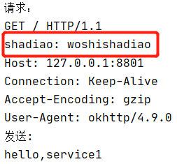
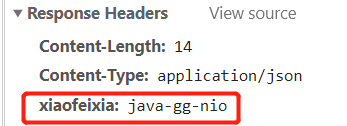

# gateway介绍

老师用的是HttpClient ，我用的是okHttp的

作业1，2，3，4就算在一起实现

## 使用okHttp异步向服务端发送请求

```
client.newCall(request).enqueue(new  Callback() {
    @Override
    public void onFailure(Call call, IOException e) {
        System.out.println("回调失败");
    }

    @Override
    public void onResponse(Call call,  Response response) throws IOException {
        System.out.println("fetchGet "+response.body().toString());
        handleResponse(fullHttpRequest,ctx,response);
    }
});
```

其他的大同小异把。

## 过滤器实现：

RequestFilter：

```
fullRequest.headers().set("shadiao", "woshishadiao");
```



ResponseFilter：

```
 response.headers().set("xiaofeixia", "java-gg-nio");
```



## 路由

通过path来选择

```
if (uri.contains("/8801")) {
    httpOutBoundHandler.handle(new HeaderHttpRequestFilter(),fullRequest, ctx,serverlist.get(0) );
} else if(uri.contains("/8802")){
    httpOutBoundHandler.handle(new HeaderHttpRequestFilter(),fullRequest, ctx,serverlist.get(1) );
}else
{
    back(fullRequest, ctx, "hello,others");
}
```

